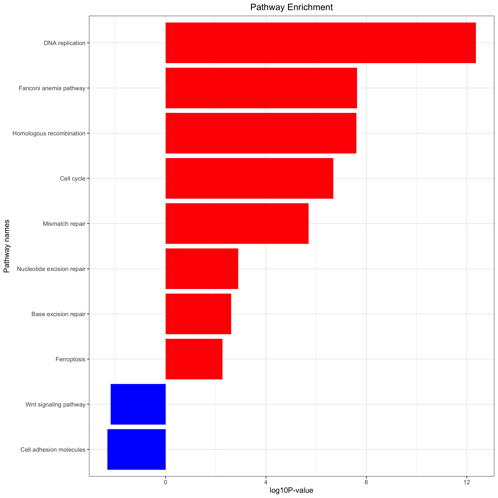

```{r setup, include=FALSE}
knitr::opts_chunk$set(echo = TRUE)
knitr::opts_knit$set(global.par = TRUE)
```
This R Markdown document is used to analysis Differentially Expressed Genes from [GSE42589](https://www.ncbi.nlm.nih.gov/geo/query/acc.cgi?acc=GSE42589).

## Step0-Packages Preparation
This step will check and install all Packages included in this analysis flow.
```{r step0-install, message=FALSE, warning=FALSE}
#source("step0-install.R")
```

## Step1-Download
This step will download and make a quick check of GSE data.
```{r cleanNamespace, include=FALSE}
rm(list = ls())  ## 魔幻操作，一键清空~
options(stringsAsFactors = F)
```

### download data
Load library
```{r load packages, message=FALSE, warning=FALSE}
library(AnnoProbe)
library(GEOquery) 
```
Data will be downloaded by `geoChina`
```{r download data, message=FALSE, warning=FALSE}
gset <- geoChina("GSE42589")
a=gset[[1]]
dat=exprs(a) #a现在是一个对象，取a这个对象通过看说明书知道要用exprs这个函数
```
获取并检查GPL信息
```{r}
gpl = a@annotation
checkGPL(gpl)
```
看一下dat这个矩阵的维度
```{r}
dim(dat)
```

### Check Data
#### Table
查看dat这个矩阵的1至4行和1至4列，逗号前为行，逗号后为列
```{r}
dat[1:4,1:4]
```

#### Plots

```{r, include=FALSE}
# 设置下一个chunk的图的边缘宽度
par(mar=c(6.5,5,1,5))
``` 
boxplot Figure \@ref(fig:bp1) 预览数据.
```{r bp1, fig.align='center', fig.width=10, fig.height=6, fig.fullwidth=TRUE, fig.cap='quick boxplot check', message=FALSE, warning=FALSE}
boxplot(dat,las=2) 
```

### Normalization
图中数据还算整齐.
查看soft文件33440行 Figure \@ref(fig:cp1) 和 文章[@KobayashiSusceptibilityDNADamage2013] 的Methods部分 可以看到已经用RMA(Robust Multi-array Average)方法进行标准化.
```{r cp1, echo=FALSE, out.width="48%", fig.show='hold', fig.cap='soft文件记录的上游分析'}
knitr::include_graphics(c("figs/normalizedbyRMA.png","figs/methodsRMA.png"))
```
所以应该可以不再用limma标准化了.
但是我想看看有啥不一样还是跑一下看看 Figure \@ref(fig:bp2).
```{r include=FALSE}
library(limma)
```

```{r bp2, fig.align='center', fig.width=10, fig.height=6, fig.fullwidth=TRUE, fig.cap='quick boxplot check after limma normalized'}

par(mfrow=c(1,2))
boxplot(dat,las=2, main="Before")
dat=normalizeBetweenArrays(dat)
boxplot(dat,las=2, main="After")
```
看上去结果几乎是一样的，整齐了一点点而已

### Clinical Information
使用 `pData` 获取临床数据
```{r}
pd=pData(a)
DT::datatable(pd[,c("title","condition:ch1","gender:ch1")])
```
挑选一些感兴趣的临床表型
分组
```{r}
library(stringr)
group_list=ifelse(grepl('control',pd$title),'control','NSCLP')
table(group_list)
```

### Probes Annotations
获取探针信息
```{r}
#getGPLAnno returns probe annotations for input gpl
probe2gene=idmap(gpl,type='soft')
head(probe2gene)
```
筛选数据对应的探针
```{r}
colnames(probe2gene)=c('probe_id','symbol')  
probe2gene=probe2gene[probe2gene$symbol != '',]
ids = probe2gene
ids=ids[ids$probe_id %in% rownames(dat),]
dim(dat)
dat=dat[as.character(ids$probe_id),]
dim(dat)
```
筛选数据中值高的
```{r}
ids$median=apply(dat,1,median) #ids新建median这一列，列名为median，同时对dat这个矩阵按行操作，取每一行的中位数，将结果给到median这一列的每一行
ids=ids[order(ids$symbol,ids$median,decreasing = T),]#对ids$symbol按照ids$median中位数从大到小排列的顺序排序，将对应的行赋值为一个新的ids
ids=ids[!duplicated(ids$symbol),]#将symbol这一列取取出重复项，'!'为否，即取出不重复的项，去除重复的gene ，保留每个基因最大表达量结果s
dat=dat[as.character(ids$probe_id),] #新的ids取出probe_id这一列，将dat按照取出的这一列中的每一行组成一个新的dat
rownames(dat)=ids$symbol#把ids的symbol这一列中的每一行给dat作为dat的行名
dim(dat)
dat[1:4,1:4]  #保留每个基因ID第一次出现的信息
```
### Save results
保存这一步的结果供后使用
```{r}
save(dat,group_list,file = 'step1-output.Rdata')
```

## step2-check
略

## step3-DEG
这一步是差异表达基因分析
### Preparation
```{r cleanNamespace2, include=FALSE}
#rm(list = ls())  ## 魔幻操作，一键清空~
#options(stringsAsFactors = F)
library(limma)
```
载入上一步的结果
```{r}
load(file = 'step1-output.Rdata')
```
通过为每个数据集绘制箱型图，比较数据集中的数据分布
按照group_list分组画箱线图

```{r, include=FALSE}
# 设置下一个chunk的图的边缘宽度
par(mar=c(2,2,1,2))
par(mfrow=c(1,1))
``` 

```{r, fig.align='center', out.width="100%", fig.fullwidth=TRUE, fig.cap='boxplot with group'}
boxplot(dat[1,]~group_list)
```
定义一个画图函数, 避免重复
```{r, fig.align='center', out.width="100%", fig.width=10, fig.height=6, fig.fullwidth=TRUE, fig.cap='boxplot with group'}
bp=function(g){         #定义一个函数g，函数为{}里的内容
  library(ggpubr)
  df=data.frame(gene=g,stage=group_list)
  p <- ggboxplot(df, x = "stage", y = "gene",
                 color = "stage", palette = "jco",
                 add = "jitter")
  #  Add p-value
  p + stat_compare_means()
}
bp(dat[1,])
```
分组信息转成因子格式
```{r}
group_list = factor( group_list ,levels = c("control","NSCLP"))
```
### DEG
#### Design
```{r}
design <- model.matrix(~0+factor(group_list))
colnames(design)=levels(factor(group_list))
head(design)
exprSet=dat
rownames(design)=colnames(exprSet)
head(design)
contrast.matrix<-makeContrasts("control-NSCLP",levels = design)
contrast.matrix ##这个矩阵声明，我们要把 NSCL/P 组跟 control 进行差异分析比较

```
#### DEG function
```{r}
deg = function(exprSet,design,contrast.matrix){
  ##step1
  fit <- lmFit(exprSet,design)
  ##step2
  fit2 <- contrasts.fit(fit, contrast.matrix) 
  ##这一步很重要，大家可以自行看看效果
  fit2 <- eBayes(fit2)  ## default no trend !!!
  ##eBayes() with trend=TRUE
  ##step3
  tempOutput = topTable(fit2, coef=1, n=Inf)
  nrDEG = na.omit(tempOutput) 
  #write.csv(nrDEG2,"limma_notrend.results.csv",quote = F)
  head(nrDEG)
  return(nrDEG)
}
```
#### access result and save
```{r}
deg = deg(exprSet,design,contrast.matrix)
head(deg)
save(deg,file = 'deg.Rdata')
```
### Plot volcano
#### Import data
```{r, fig.align='center', out.width="100%", fig.width=10, fig.height=6, fig.fullwidth=TRUE, fig.cap='boxplot with group'}
load(file = 'deg.Rdata')
head(deg)
bp(dat[rownames(deg)[1],])
```

#### Plot and save
```{r}
nrDEG=deg
head(nrDEG)
attach(nrDEG)
#plot(logFC,-log10(P.Value))
library(ggpubr)
df=nrDEG
df$v= -log10(P.Value) #df新增加一列'v',值为-log10(P.Value)
#ggscatter(df, x = "logFC", y = "v",size=0.5)

df$g=ifelse(df$P.Value>0.009,'stable', #if 判断：如果这一基因的P.Value>0.01，则为stable基因
            ifelse( df$logFC >1.129,'up', #接上句else 否则：接下来开始判断那些P.Value<0.01的基因，再if 判断：如果logFC >1.5,则为up（上调）基因
                    ifelse( df$logFC < -1,'down','stable') )#接上句else 否则：接下来开始判断那些logFC <1.5 的基因，再if 判断：如果logFC <1.5，则为down（下调）基因，否则为stable基因
)
table(df$g)
```
这个上下调的数量和原文存在差异
图中是原文[@KobayashiSusceptibilityDNADamage2013]中的上下调数量和原文[@KobayashiSusceptibilityDNADamage2013]Table_S1中的阈值Figure \@ref(fig:cp2)
```{r cp2, echo=FALSE, out.width="48%", fig.show='hold', fig.cap='原文中差异基因分析的结果'}
knitr::include_graphics(c("figs/DEGyuanwen.png","figs/yuanwenTable_S1.png"))
```
#### 火山图
```{r}
df$name=rownames(df)
head(df)
#ggscatter(df, x = "logFC", y = "v",size=0.5,color = 'g')
ggscatter(df, x = "logFC", y = "v", color = "g",size = 0.5,
          label = "name", repel = T,
          label.select = rownames(df)[df$g != 'stable'] ,
          #label.select = c('TTC9', 'AQP3', 'CXCL11','PTGS2'), #挑选一些基因在图中显示出来
          palette = c("#00AFBB", "#E7B800", "#FC4E07") )
ggsave('volcano.png')

#ggscatter(df, x = "AveExpr", y = "logFC",size = 0.2)
df$p_c = ifelse(df$P.Value<0.001,'p<0.001',
                ifelse(df$P.Value<0.01,'0.001<p<0.01','p>0.01'))
table(df$p_c )
ggscatter(df,x = "AveExpr", y = "logFC", color = "p_c",size=0.2, 
          palette = c("green", "red", "black") )
ggsave('MA.png')
```

### Plot Heatmap
```{r}
load(file = 'step1-output.Rdata')
# 每次都要检测数据
dat[1:4,1:4]
table(group_list)
x=deg$logFC #deg取logFC这列并将其重新赋值给x
names(x)=rownames(deg) #deg取probe_id这列，并将其作为名字给x
cg=c(names(head(sort(x),10)),#对x进行从小到大排列，取前100及后100，并取其对应的探针名，作为向量赋值给cg
     names(tail(sort(x),10)))
library(pheatmap)
#pheatmap(dat[cg,],show_colnames =F,show_rownames = F) #对dat按照cg取行，所得到的矩阵来画热图
n=t(scale(t(dat[cg,])))#通过“scale”对log-ratio数值进行归一化，现在的dat是行名为探针，列名为样本名，由于scale这个函数应用在不同组数据间存在差异时，需要行名为样本，因此需要用t(dat[cg,])来转换，最后再转换回来

n[n>2]=2
n[n< -2]= -2
n[1:4,1:4]
#pheatmap(n,show_colnames =F,show_rownames = F)
ac=data.frame(group=group_list)
rownames(ac)=colnames(n) #将ac的行名也就分组信息（是‘no TNBC’还是‘TNBC’）给到n的列名，即热图中位于上方的分组信息
pheatmap(n,show_colnames =T,
         show_rownames = T,
         cluster_cols = T, 
         annotation_col=ac,filename = 'heatmap_top20_DEG.png') #列名注释信息为ac即分组信息
```
保存这一步的结果供后使用
```{r}
write.csv(deg,file = 'deg.csv')
```

## step4-anno-go-kegg

这一步是富集分析

### Preparation

```{r cleanNamespace3, include=FALSE}
rm(list = ls())  ## 魔幻操作，一键清空~
options(stringsAsFactors = F)
library(ggplot2)
library(clusterProfiler)
library(org.Hs.eg.db)
library(stringr)
```
载入上一步保存的数据
```{r}
load(file = 'deg.Rdata')
head(deg)
```
不同的阈值，筛选到的差异基因数量就不一样，后面的超几何分布检验结果就大相径庭。
```{r}
#logFC_t=1.5
deg$g=ifelse(deg$P.Value>0.009,'stable',
            ifelse( deg$logFC > 1.129,'UP',
                    ifelse( deg$logFC < -1,'DOWN','stable') )
)
table(deg$g)
head(deg)
```
将gene id symbol 转化成 entrezgene ID
```{r message=FALSE, warning=FALSE}
deg$symbol=rownames(deg)
df <- bitr(unique(deg$symbol), fromType = "SYMBOL",
           toType = c( "ENTREZID"),
           OrgDb = org.Hs.eg.db)
head(df)
```
合并保存数据集
```{r}
DEG=deg
head(DEG)
DEG=merge(DEG,df,by.y='SYMBOL',by.x='symbol')
head(DEG)
save(DEG,file = 'anno_DEG.Rdata')
```
筛选差异数据并保存ENTREZID
```{r}
gene_up= DEG[DEG$g == 'UP','ENTREZID'] 
gene_down=DEG[DEG$g == 'DOWN','ENTREZID'] 
gene_diff=c(gene_up,gene_down)
gene_all=as.character(DEG[ ,'ENTREZID'] )
data(geneList, package="DOSE")
head(geneList)
```
logFC的box plot
```{r bp3, fig.align='center', fig.width=10, fig.height=6, fig.fullwidth=TRUE, fig.cap='boxplot of Dose and logFC'}
par(mfrow=c(1,2))
boxplot(geneList)
boxplot(DEG$logFC)
```
整合ENTREZID并排序
```{r}
geneList=DEG$logFC
names(geneList)=DEG$ENTREZID
geneList=sort(geneList,decreasing = T)
```
### 富集分析
载入富集分析脚本并进行分析
```{r}
#source('kegg_and_go_up_and_down.R')
#run_kegg(gene_up,gene_down,pro='yonghe')
```
富集图
```{r cp3, echo=FALSE, out.width="100%", fig.show='hold', fig.cap='Pathway 富集'}

```
### GO分析
```{r}
go <- enrichGO(gene_up, OrgDb = "org.Hs.eg.db", ont="all")
```
作图
```{r, fig.cap='gene_up_GO_all_barplot',fig.align='center', out.width="100%", fig.width=10, fig.height=6, fig.fullwidth=TRUE}
barplot(go, split="ONTOLOGY",font.size =10)+ 
  facet_grid(ONTOLOGY~., scale="free") + 
  scale_x_discrete(labels=function(x) str_wrap(x, width=50))+
  ggsave('gene_up_GO_all_barplot.png')
```
下调的GO分析没有找到结果
```{r}
god <- enrichGO(gene_down, OrgDb = "org.Hs.eg.db", ont="all") 
# barplot(go, split="ONTOLOGY",font.size =10)+ 
#   facet_grid(ONTOLOGY~., scale="free") + 
#   scale_x_discrete(labels=function(x) str_wrap(x, width=50))+
#   ggsave('gene_down_GO_all_barplot.png')
god
```
### 与原文对比
比较一下我的和它的GO分析图
```{r cp4, echo=FALSE, out.width="48%", fig.show='hold', fig.cap='原文(左)和我的(右)GO分析图'}
knitr::include_graphics(c("figs/yuanwenGO.png","gene_up_GO_all_barplot.png"))
```
## References
